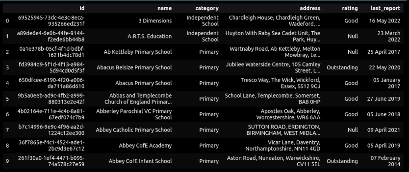
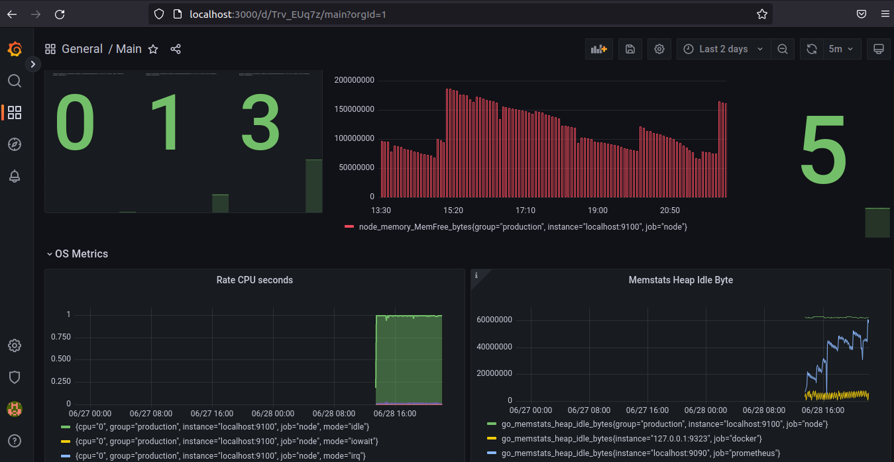
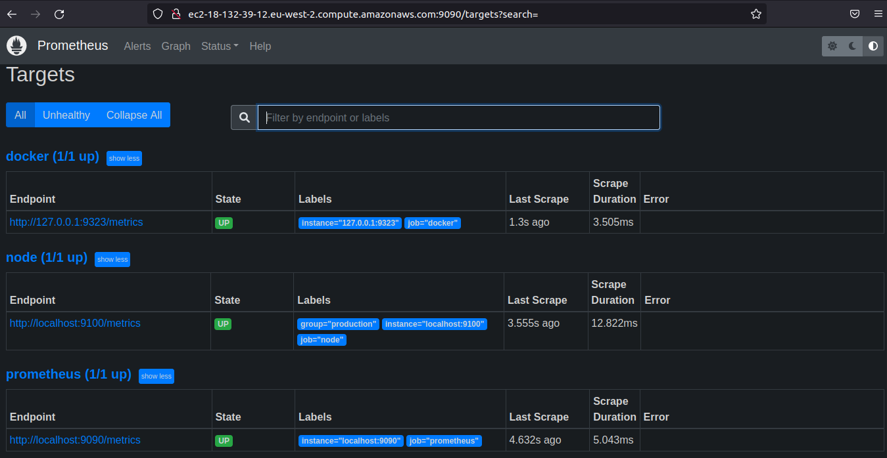

# Data Pipeline

This is the web scraper project that employs the scraper on the Ofsted website for primary and secondary public schools
The idea is to collect all the information for quick update on last reports and rating of various schools.

The project uses Python, Selenium, Chromedrive, AWS S3, AWS RDS
 to perform the above

## Table of Contents
* [General Info](#general-information)
* [Technologies Used](#technologies-used)
* [Features](#features)
* [Screenshots](#screenshots)
* [Setup](#setup)
* [Usage](#usage)
* [Project Status](#project-status)
* [Room for Improvement](#room-for-improvement)
* [Acknowledgements](#acknowledgements)
* [Contact](#contact)


## General Information
- The project came as an idea of combining data mining/ pipeline and education.
- The pipeline uses various techniques and engines to collect, store, process, display information about data and system metrics as well.


## Technologies Used
- Python 3.9.7
- Chromedriver: latest
- Chrome: latest
- AWS S3
- AWS RDS and Pg4Admin/ PostgreSQL
- AWS EC2 instance
- Docker and Dockerd set up on the EC2 instance
- Prometheus
- Node-Exporter
- Grafana Dashboard


## Features
Scraper code:
- run unittests for XPATHS, inputs, cookies
- takes user input
- accepts cookies
- scrapes data according to selected number of pages
- creates json file for tabular data, uploads to AWS S3 bucket and to Postgres RDS/PG4Admin
- screenshots images, 10 per page, uploaded to AWS S3
- checks if piece of data already exsists based on uuid
- removes all scraped data localy  

Additional applications:
- Scraper is dockerized and container is spun on AWS EC2 instance
- Scraper is run in headless mode from the EC2 instance
- Prometheus monitoring is added on top of the container to monitor docker state on EC2
- Node-exporter is installed and added to Prometheus to monitor hardware metrics
- Grafana dashboard is created onthe local machine to monitor the metrics of the containers (Docker) and the hardware metrics of the EC2 instance.

CI/CD Pipeline:
- Github secrets/ github actions # file main.yml created to monitor master branch update and push updates to dockerhub using docker access token saved as github secret
- Cron is set up on EC2 to remove, pull, run container with scraper every 24 hours


## Screenshots
The scraper does image scraping from each school name, address, unique ID registered with Ofsted

- School's snapshot that is being collected


- Dataframe sample


- Grafana Dashboard


- Prometheus Targets set up (the screenshot shows EC2 instance public IP for demonstration)



## Setup
The required libraries are:
boto3==1.23.10
pandas==1.4.2
psycopg2==2.9.3
psycopg2_binary==2.9.3
requests==2.27.1
selenium==4.2.0
SQLAlchemy==1.4.32
urllib3==1.26.9
webdriver_manager==3.7.0


Required additional modules:
- import config: xpath constants, input RDS credentials
- the aws_keys.py is a private/hidden file
- test_module (test_module.py). Module checks: 
    - if buildin link and xpaths are active and valid
    - if inputs provide required variable assignments


## Usage
1. The code gives an option for the user to enter required categories (partial code below)
```
def options():
    category_choice=input('Please Select: 1 - Education and Training; 2 - Chilcare and Early Education')
    if category_choice == "1":
        category_choice== "Education and Training"
        age = input('Please Select: 1 - Primary, 2 - Secondary')
        if age == "1":
            return [category_choice, "Primary"]
        
        elif age == "2":
            return [category_choice, "Secondary"]
        
        else:
            print("You must choose between 1 or 2")
            return options()
```

2. Intro into of the scraper class:
```
class ofsted_scraper (partial code below):
    '''
    Extract the data on schools with the rating and last report from ofsted website,
    the data is based on the inputs: pre-nursery/nursery/primary/secondary

    Attributes:
        URL (str): The ofsted URL, which will be modified based on the provided inputs
    '''
    def __init__(self, xpath_category: str, xpath_age:str):
        self.URL="https://reports.ofsted.gov.uk/"
        options = Options()
        options.headless = True
        self.driver = webdriver.Chrome(options=options)
        self.xpath_category=xpath_category
        self.xpath_age=xpath_age
```

3. Selenium drive is used to control the link(s) and take snapshots of the linked school
```
def __get_screenshot_item(self,item,name):
        item.find_element(By.PARTIAL_LINK_TEXT, name).click()
        pic_element = self.driver.find_element(By.XPATH, config.XPATH_PIC)
        file_name=str("scraper/raw_data/ofsted_reports/images/"+name+".png")
        s3_name=str(name+".png")
        screenshot_as_bytes = pic_element.screenshot_as_png
        os.makedirs("scraper/raw_data/ofsted_reports/images/", exist_ok=True)
        with open(file_name, 'wb') as f:
            f.write(screenshot_as_bytes)
        s3_client =boto3.client('s3', region_name=aws_keys.AWS_REGION, aws_access_key_id=aws_keys.AWS_ACCESS_KEY_ID, aws_secret_access_key=aws_keys.AWS_SECRET_ACCESS_KEY))
        s3_client.upload_file(file_name, 'ofstedscraper', s3_name)
        os.remove(file_name) 
        time.sleep(3)
        self.driver.back()
        time.sleep(3)
```

4. Data is uploaded to AWS, after being checked if already exists
```
def aws_upload(self,df):
    """Method uses AWS S3 bucket and RDS, and dumps the json file that contains data scraped from the current page,
    removes the file from the directory to minimise the required storage space.
    Args:
        page (int): current webpage number that has been used for data scraping
    """   
    #convert df into json file
    df.to_json('scraper/raw_data/ofsted_reports/data.json', orient='records', lines=True )
    
    #send df back to Aws RDS
    df.to_sql("ofstedscraper", self.engine, if_exists="replace")

    #upload json S3 bucket     
    s3_name=str('full_data.json')
    s3_client =boto3.client('s3', region_name=aws_keys.AWS_REGION, aws_access_key_id=aws_keys.AWS_ACCESS_KEY_ID,
                        aws_secret_access_key=aws_keys.AWS_SECRET_ACCESS_KEY)
    s3_client.upload_file('scraper/raw_data/ofsted_reports/data.json', 'ofstedscraper', s3_name)
                
    #remove json files from the system
    os.remove('scraper/raw_data/ofsted_reports/data.json')

```


## Project Status
Project is: _in progress_ 


## Room for Improvement
Room for improvement:
- The project will benefit from the selection of the driver as an option for various web browsers: Firefox, Safari, etc.
- The option for the user to have a choice of either print the data on screen or store the file remotely as at present
- The visualisation/ dashboard of the data as per the user request.
- Checkin the last date report in addition to the name for potential updates


## Acknowledgements
- This project was inspired by AiCore program and my background in education.


## Contact
Created by [@IrinaKW](irina.k.white@gmail.com) - feel free to contact me!

